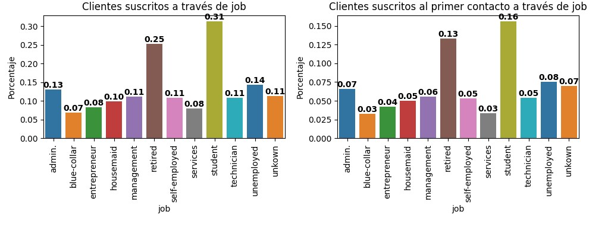
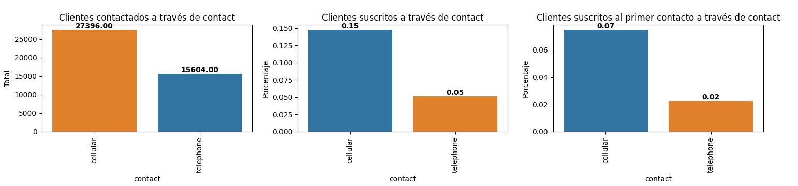
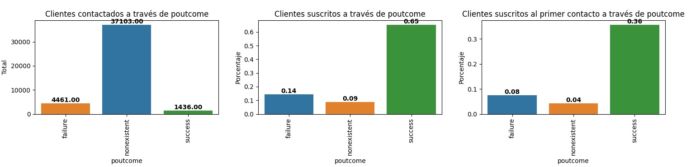

# 🌟 Análisis de Campaña de Marketing Bancario en Portugal

<div style="height: 600px; width: 1500px; text-align: center; ">
    
</div>

[](https://www.python.org/)
[](https://jupyter.org/)
[](https://pandas.pydata.org/)
[](https://seaborn.pydata.org/)

---

## 🔍 Descripción del Proyecto

Este proyecto tiene como objetivo analizar los datos de una campaña de marketing de un banco portugués orientada a la contratación de depósitos a plazo. A través del análisis de datos demográficos y conductuales de los clientes, se busca identificar patrones comunes entre los clientes que se han suscrito al producto, y proponer estrategias de mejora en la segmentación y eficiencia de futuras campañas.

---

## 📂 Tabla de Contenidos

* [Datos Utilizados](#datos-utilizados)
* [Proceso de Análisis](#proceso-de-análisis)

  * [Limpieza de Datos](#limpieza-de-datos)
  * [Análisis Exploratorio](#análisis-exploratorio)
  * [Visualización](#visualización)
* [Principales Hallazgos](#principales-hallazgos)
* [Visualizaciones](#visualizaciones)
* [Conclusiones y Recomendaciones](#conclusiones-y-recomendaciones)
* [Instalación y Configuración](#instalación-y-configuración)
* [Estructura del Proyecto](#estructura-del-proyecto)
* [Guía de Uso](#guía-de-uso)
* [Próximos Pasos](#próximos-pasos)
* [Contribución y Contacto](#contribución-y-contacto)
* [Licencia](#licencia)
* [Agradecimientos](#agradecimientos)

---

<a id="datos-utilizados"></a>
## 📅 Datos Utilizados

* **Fuente:** [thePower- DataProject: Proyecto EDA con Python](https://s3.amazonaws.com/staticcontent.thepowermba/Bootcamp+Data+%26+Analytics/D%26A24/Phyton/DatosProyecto.rar)

* **Fichero bank-additional.csv** 
    * **Filas:** 43.000  
    * **Columnas:** 23
    * **Observaciones:** Tenemos 10 columnas con valores nulos. El tipo de datos de los valores de algunas columnas es incorrecto

    ### Diccionario de Datos Resumido

    | Columna    | Descripción                       | Tipo       |
    | ---------- | --------------------------------- | ---------- |
    | age        | Edad del cliente                  | Numérico   |
    | job        | La ocupación o profesión del cliente   | Categórico |
    | marital    | Estado civil                      | Categórico |
    | education  | Nivel educativo                   | Categórico |
    | default    | Indica si el cliente tiene algún historial de incumplimiento de pagos (1: Sí, 0: No)            | Binario    |
    | housing    | ¿Tiene préstamo de vivienda? (1: Sí, 0: No)      | Binario    |
    | loan       | ¿Tiene otro préstamo personal? (1: Sí, 0: No)    | Binario    |
    | contact    | Método de contacto utilizado para comunicarse con el cliente                  | Categórico |    
    | duration   | Duración de última llamada (seg)  | Numérico   |
    | campaign   | Nro. de contactos durante campaña | Numérico   |
    | pdays      | Número de días que han pasado desde la última vez que se contactó con el cliente durante esta campaña     | Numérico    |
    | previous   | Número de veces que se ha contactado con el cliente antes de esta campaña                 | Numérico   |
    | poutcome   | Resultado de la campaña de marketing anterior                         | Categórico |
    | emp.var.rate    | La tasa de variación del empleo                      | Numérico |
    | cons.price.idx  | El índice de precios al consumidor                  | Categórico |
    | cons.conf.idx    | El índice de confianza del consumidor           | Categórico    |
    | euribor3m    | La tasa de interés de referencia a tres meses      | Categórico    |
    | nr.employed       | El número de empleados   | Categórico    |
    | y    | Indica si el cliente ha suscrito un producto o servicio (Sí/No)                  | Categórico |    
    | date   | La fecha en la que se realizó la interacción con el cliente   | Fecha / hora |
    | latitude   | Columna errónea | Numérico   |
    | longitude      | Columna errónea     | Numérico    |
    | id_      | Un identificador único para cada registro en el dataset.     | Categórico    |

* **Fichero customer-detail.xlxs**
    * **Observaciones:** Este fichero consta de 3 hojas. Las 3 hojas tienen las mismas columnas con el mismo nombre. Agrupamos las 3 hojas en un solo dataframe. Las columnas no tienen valores nulos.

     ### Diccionario de Datos Resumido

    | Columna    | Descripción                       | Tipo       |
    | ---------- | --------------------------------- | ---------- |
    | Income        | Representa el ingreso anual del cliente en términos monetarios                 | Numérico   |
    | Kidhome       | Indica el número de niños en el hogar del cliente                         | Numérico |
    | Teenhome      | Indica el número de adolescentes en el hogar del cliente                     | Numérico |
    | Dt_Customer   | Representa la fecha en que el cliente se convirtió en cliente de la empresa                  | Fecha / hora |
    | NumWebVisitsMonth    | Indica la cantidad de visitas mensuales del cliente al sitio web de la empresa           | Numérico    |
    | ID    | Identificador único del cliente     | Categórico    |
    

<a id="proceso-de-análisis"></a>
## ⚖️ Proceso de Análisis 
<a id="limpieza-de-datos"></a>
### 🚼 Limpieza de Datos 
* Eliminamos las columnas 'latitude' y 'longitude'.
* Convertimos todos los datos del dataframe a minúsculas para homogeneizar los datos.  
* Sustituimos las "," por los puntos en las columnas 'cons_price_idx', 'cons_conf_idx', 'euribor3m', 'nr_employed'.  
* Hacemos una conversión en la columna date, donde cambiamos el nombre del mes por el número correspondiente.  
* Cambiamos el tipo de datos de las columnas de tipo fecha y de las columnas de tipo numéricas.
* Cambiamos los valores 1, 0, nan por 'Yes', 'No', 'None' en las columnas 'default', 'housing' y 'loan'
* En la columna 'pdays', cambiamos el valor 999 por -1, para tener los datos más agrupados.

* Creamos las nuevas columnas:
    * contact_year: año de la interacción del banco con el cliente
    * contact_month: mes de la interacción del banco con el cliente
    * customer_year: año en el que se convirtió en cliente de la empresa.
    * customer_month: mes en el que se convirtió en cliente de la empresa.
    * Creamos la columna 'subscribed' para tener un título más aclarativo y borramos la columna original 'y'.  
    * Creamos la columna 'duration_min' para tener los tiempos de las llamadas en minutos y eliminamos la columna 'duration'. 
    * Creamos la columna 'FCR' para saber cuando clientes contrataron en el primer contacto.

<a id="análisis-exploratorio"></a>
### 💡 Análisis Exploratorio

* Realizamos gráficos de barra para analizar las variables categóricas.
    * Gestionamos los valores nulos de las columnas 
        - job: rellenamos los calores con 'unkown'.
        - marital: rellenamos los calores con 'unkown'.
        - education: rellenamos los calores con 'unkown'.
        - default: tiene un 0.999912 con valores 'no' y un 0.000088 con valores 'yes'. Al tener un 20.88% de valores nulos, decidimos que ese valor es muy alto y rellenaremos con 'unknow'. 
        - housing: 'housing' tiene el mismo porcentage de valores nulos que 'loan', pero ninguna categoría predominante.
        - loan: tiene un 0.84438 con valores 'no' y un 0.15562 con valores 'yes'. Su porcentaje de nulos es de 2.38%, en esta columna si que vamos a rellenar lo valores nulos con 'no'.  

* Realizamos histogramas y diagramas de caja para analizar las variables numéricas.
    - Encontramos outliers en las columnas age, duration_min, campaign, previous, cons_conf_idx, pdays.
        - No vamos a eliminar nungún registro de las columnas con outliers. El número de regisrtos y el porcentaje de los outliers no justifica su eliminación o cambio de valor.
    * Gestionamos los valores nulos. Dividimos las columnas en las que tiene un umbra superior al 5% e inferior al 5%.
        * Inferior al 5%. Utilizamos el método fillna para rellenar los nulos:
            * cons_price_idx: con outliers y valores no uniformes. Valores similares entre media y mediana. Rellenamos nulos con la media.
            * contact_year: no tiene outliers, distribución uniforme, valores similares entre media y mediana. Utilizamos la  mediana, al ser un año no podemos tener decimales.
            * contact_month: no tiene outliers, distribución uniforme, valores similares entre media y mediana. Utilizamos la  mediana, al ser un año no podemos tener decimales.
        * Superior al 5%. Utilizamos los método iteriteveimputer y knn  para rellenar los nulos:
            * Nos quedaremos con los valores del knn
                - age: la mediana del knn se acerca más a la mediana original, y la media se desvía un poco más que la del iterative, pero no mucho. Nos quedaremos con los valores del knn.
                - euribor3m: la media del iterative es igual que la media del original. La mediana se acerca más la del knn.
            * La columna age pasa a ser age_knn y la columna euribor3m pasa a ser eutibor3m_knn

* Realizamos histogramas y diagramas de caja para analizar las variables de tipo fecha.
    - Estas columnas no presentas outliers.

* Cálculo de tasas de conversión.
* Cálculo de tasa de resolución en el primer contacto.

<a id="visualización"></a>
### 🎨 Visualización

* Gráficos de barra (countplot), histogramas (histplot), diagramas de caja (boxplot) y diagramas de barra (barplot) para detectar patrones.

---
<a id="principales-hallazgos"></a>
## 📊 Principales Hallazgos

* **Tasa de conversión general:** `tasa = 11,27%`
* **Tasa de resolución en el primer contacto:** `tasa = 5,57%`
* Clientes contactados a través del móvil tienen mayor conversión.
* Profesiones como "student" y "retired" muestran tasas altas de suscripción.
* Cliente que ya habían contratado un servicio con el banco anteriormente vuelven a contratar servicios.
  
---
<a id="visualizaciones"></a>
## 🖼️ Visualizaciones

  > **Gráfico 1:** Profesiones con mayor % de conversión.
<div style="text-align: left; ">
    
</div>

  > **Gráfico 2:** Impacto del tipo de contacto.
<div style="text-align: left; ">
    
</div>

  > **Gráfico 3:** Cliente que habían contratado en la campaña de marketing anterior.
<div style="text-align: left; ">
    
</div>

---
<a id="conclusiones-y-recomendaciones"></a>
## 📖 Conclusiones y Recomendaciones
    
**Conclusión:**
* La campaña de marketing ha sido mala. Solamente han conseguido captar el 11% de clientes a los que han contactado, de los cuales el 5% fueron en la primera llamada.
* Parece que no se han enfocado al público correcto. 

**Recomendaciones:**
* **Segmentar futuras campañas** jubilados o estudiantes.
* Priorizar el uso de **contacto a través del móvil**.
* Invertir en llamadas de mayor duración (indicador indirecto de interés).
* Centrarse en personas del propio banco que ya hayan contratado un servicio con anterioridad.
* Excluir perfiles con baja probabilidad para mejorar ROI.

---
<a id="instalación-y-configuración"></a>
## 🛠️ Instalación y Configuración en windows

```bash
# Clona el repositorio
git clone https://github.com/SergioSalm/DataProject_ProyectoEDAConPython.git
cd nombre_del_repositorio

# Crea un entorno virtual (opcional)
python3 -m venv venv
source venv/Scripts/activate

# Instala dependencias
pip install -r requirements.txt
```

---
<a id="estructura-del-proyecto"></a>
## 📁 Estructura del Proyecto

```
.
├── data/                           # Datos brutos y procesados
│  ├─ Orig                          # Carpeta con los archivos originales
│  │  ├─ bank-additional.csv        
│  │  ├─ customer-details.xlsx
│  ├─ transformados                 # Carpeta con los archivos transformados
│  │  ├─ bank-customers-detail.csv
│  ├─ data-clean.csv                # Fichero con los datos limpios
│  ├─ data-metricas.csv             # Fichero con los datos para las métricas
├── jupyters/                       # Jupyter Notebooks con los ficheros para el análisis
│  ├─ 1-EDA_preliminar.ipynb   
│  ├─ 2-limpieza.ipynb              # Limpieza y transformación de datos
│  ├─ 3-columnas_categoricas.ipynb  # Análisis de las columnas categóricas y su gestión de los valores nulos
│  ├─ 4-columnas_numericas.ipynb    # Análisis de las columnas categóricas y su gestión de los valores nulos
│  ├─ 5-marketing.ipynb             # Análisis de las métricas
├── images/                         # Visualizaciones exportadas
│  ├─ bank.jpeg
│  ├─ contact.jpg
│  ├─ job.jpg
│  ├─ previousOut.jpg
├── src/                            # Archivos de soporte de python
│  ├─ sp_limpieza.py                # Funciones utilizadas en el archivo 'limpieza.ipnyb'
│  ├─ sp_analisis.py                # Funciones utilizadas en el análisis de las columnas categóricas y numéricas
│  ├─ sp_visualizacion.py           # Funciones utilizadas para visualizar gráficos de las columnas categóricas y numéricas   
├── README.md             # Documentación principal
└── requirements.txt      # Dependencias del proyecto
```

---
<a id="guía-de-uso"></a>
## 🔧 Guía de Uso

1. Abre la carpeta jupyters y ejecuta los ficheros en el siguiente orden:
    - [1-EDA_preliminar.ipynb](jupyters/1-EDA_preliminar.ipynb)
    - [2-limpieza.ipynb](jupyters/2-limpieza.ipynb)
    - [3-columnas_categoricas.ipynb](jupyters/3-columnas_categoricas.ipynb)
    - [4-columnas_numericas.ipynb](jupyters/4-columnas_numericas.ipynb)
    - [5-marketing.ipynb](jupyters/5-marketing.ipynb)

2. Ejecuta célula por célula para replicar el análisis.
3. Revisa los gráficos generados y modifica filtros para nuevas segmentaciones.

---
<a id="próximos-pasos"></a>
## 📈 Próximos Pasos

* Implementar modelos predictivos.
* Automatizar el análisis para nuevas campañas.

---
<a id="contribución-y-contacto"></a>
## 🛠️ Contribución y Contacto

¡Contribuciones bienvenidas! Abre un pull request o contacta:

* Sergio Salmerón - [GitHub Profile](https://github.com/SergioSalm)

---
<a id="licencia"></a>
## ✉️ Licencia
Este proyecto está licenciado bajo la licencia MIT.


---
<a id="agradecimientos"></a>
## 🙏 Agradecimientos

Gracias a:

* **thePower Business School** por ofrecer el curso y la guía en el desarrollo de este proyecto de análisis de datos.
* Comunidad de Python y Data Science por recursos y documentación.

---


